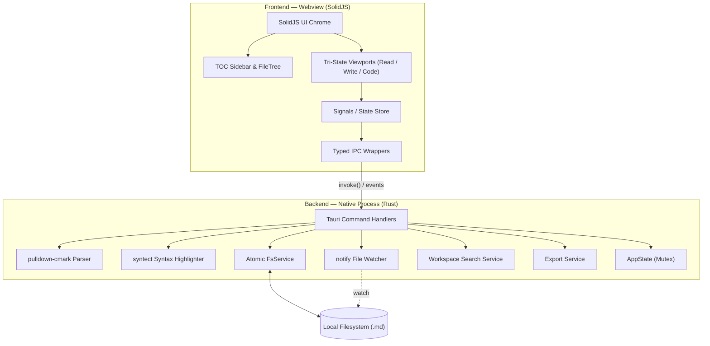

<div align="center">

# ✨ Lexora

**A Typora-style, high-performance Markdown reader & editor built with Tauri 2 + Rust + SolidJS.**

[](https://github.com/BerryUIKI/Lexora/releases)
[](LICENSE)
[](https://tauri.app)
[](https://www.rust-lang.org/)
[](https://www.solidjs.com/)
[](https://tailwindcss.com/)
[](docs/CONTRIBUTING.md)

<p align="center">
  <b>Local-first</b> • <b>Blazing fast</b> • <b>Zero split-panes</b> • <b>Tiny bundle (~3.4 MB)</b>
</p>

</div>

---

## 📖 Introduction

**Lexora** is an open-source Markdown reader and editor engineered for writers, developers, and researchers who want the power of plain-text Markdown without the cognitive overhead of split-screen previews.

Built on **Tauri 2** and **Rust** with a fine-grained reactive **SolidJS** frontend, Lexora combines native desktop responsiveness with a minimalist, distraction-free aesthetic.

```
┌─────────────────────────────────────────────────────────────────────────────┐
│ Lexora                                                                — □ ✕ │
├───────────────┬─────────────────────────────────────────────────────────────┤
│ 📁 Workspace  │  [Tab 1: README.md ●]  [Tab 2: notes.md]              +     │
│ ├─ docs/      ├─────────────────────────────────────────────────────────────┤
│ ├─ src/       │   # Introduction                                            │
│ └─ README.md  │                                                             │
│               │   Lexora eliminates split-screen previews by rendering      │
│ 📑 Outline    │   Markdown directly in place.                               │
│ • Overview    │                                                             │
│ • Features    │   | Feature         | Performance  | Memory  |              │
│ • Shortcuts   │   |-----------------|--------------|---------|              │
│               │   | Startup Time    | < 500 ms     | ~30 MB  |              │
│               │   | Parsing Speed   | Zero-copy    | Minimal |              │
│               │                                                             │
├───────────────┴─────────────────────────────────────────────────────────────┤
│ ◧  📖 Reading | ✍️ Writing | 💻 Code   Ln 1, Col 1 | 1,420 words | UTF-8 | LF│
└─────────────────────────────────────────────────────────────────────────────┘
```

---

## 🌟 Key Features

| Feature | Description | Status |
|---|---|:---:|
| 🔄 **Tri-State Display Modes** | Quickly switch at the bottom: **Reading** (read-only), **Writing** (WYSIWYG), **Code** (raw source) | ✅ Complete |
| 📥 **Intelligent Drag & Drop** | Drag file to window to open; drag onto tab bar for new tab; drag onto editor to insert Markdown links | ✅ Complete |
| ✍️ **In-Place WYSIWYG** | Typora-style inline editing with Milkdown v7 & ProseMirror undo/redo history | ✅ Complete |
| 💾 **Atomic File I/O** | Crash-safe atomic saving (`write to .tmp -> rename`) with dirty state tracking | ✅ Complete |
| 📂 **Workspace Tree & Tabs** | Multi-document tabs, recursive file tree CRUD, and quick switcher (<kbd>Ctrl+P</kbd>) | ✅ Complete |
| 🌈 **Code Syntax Highlighting** | Sublime-grade code block syntax highlighting via `syntect` with copy button | ✅ Complete |
| 📑 **TOC Navigation** | Auto-generated Table of Contents with smooth scrolling to sections | ✅ Complete |
| 🔍 **Find & Replace** | In-document search with regex, case sensitivity, and match jumping (<kbd>Ctrl+F</kbd>/<kbd>Ctrl+H</kbd>) | ✅ Complete |
| 🔎 **Global Workspace Search** | Workspace-wide ripgrep-style search across all files with line previews (<kbd>Ctrl+Shift+F</kbd>) | ✅ Complete |
| 📤 **Standalone HTML/PDF Export** | Export self-contained styled HTML documents with print typography | ✅ Complete |
| 📊 **Mermaid Diagrams & Math** | Live rendering containers for `mermaid` diagrams and LaTeX math blocks | ✅ Complete |
| 🧘 **Zen & Focus Modes** | Full-screen distraction-free layout (<kbd>F11</kbd> / <kbd>Ctrl+Shift+Z</kbd>) | ✅ Complete |
| 🛡️ **File Watcher** | Real-time background detection of external file edits via `notify` | ✅ Complete |
| 🎨 **Theme Palette** | Tokyo Night-inspired dark mode, clean light mode, and system auto-sync | ✅ Complete |
| 📦 **Tiny Footprint** | Complete NSIS installer under **3.4 MB**; launch time under 500 ms | ✅ Complete |

---

## 📥 Installation & Download

### Windows
Download the latest binaries from our [**GitHub Releases**](https://github.com/BerryUIKI/Lexora/releases):

- **Standard Installer (Recommended)**: [`Lexora_x64-setup.exe`](https://github.com/BerryUIKI/Lexora/releases) *(3.38 MB)*
- **Enterprise MSI Package**: [`Lexora_x64_en-US.msi`](https://github.com/BerryUIKI/Lexora/releases) *(4.92 MB)*
- **Standalone Portable**: [`lexora.exe`](https://github.com/BerryUIKI/Lexora/releases) *(run directly without installation)*

---

## ⌨️ Keyboard Shortcuts

| Shortcut | Action |
|---|---|
| <kbd>Ctrl</kbd> + <kbd>O</kbd> | Open Markdown file via native dialog |
| <kbd>Ctrl</kbd> + <kbd>N</kbd> | Create new document |
| <kbd>Ctrl</kbd> + <kbd>S</kbd> | Save active document (atomic write) |
| <kbd>Ctrl</kbd> + <kbd>P</kbd> | Quick Switcher file palette |
| <kbd>Ctrl</kbd> + <kbd>F</kbd> / <kbd>Ctrl</kbd> + <kbd>H</kbd> | Find & Replace toolbar |
| <kbd>Ctrl</kbd> + <kbd>Shift</kbd> + <kbd>F</kbd> | Global workspace full-text search |
| <kbd>Ctrl</kbd> + <kbd>/</kbd> | Cycle Display Mode (Reading / Writing / Code) |
| <kbd>Ctrl</kbd> + <kbd>B</kbd> | Toggle Workspace & Outline Sidebar |
| <kbd>F11</kbd> / <kbd>Ctrl</kbd> + <kbd>Shift</kbd> + <kbd>Z</kbd> | Toggle Distraction-Free Zen Mode |
| <kbd>Ctrl</kbd> + <kbd>Z</kbd> | Undo |
| <kbd>Ctrl</kbd> + <kbd>Y</kbd> | Redo |

---

## 🏗️ Architecture & Technology Stack

Lexora is built with a dual-runtime architecture emphasizing safety and performance:



- **Backend**: [Rust](https://www.rust-lang.org/) + [Tauri 2](https://tauri.app/) for native capabilities, system windowing, security sandboxing, and atomic file I/O.
- **Frontend**: [SolidJS](https://www.solidjs.com/) + [TypeScript](https://www.typescriptlang.org/) for surgical DOM updates without virtual DOM overhead.
- **Styling**: [Tailwind CSS 4](https://tailwindcss.com/) with custom CSS properties for dynamic theming.
- **Parsing**: [pulldown-cmark](https://github.com/raphlinus/pulldown-cmark) for zero-copy, CommonMark & GFM compliant parsing.
- **Syntax Highlighting**: [syntect](https://github.com/trishume/syntect) for Sublime Text-grade syntax coloring.

---

## 🛠️ Development & Building from Source

### Prerequisites
- [Node.js](https://nodejs.org/) 20+
- [pnpm](https://pnpm.io/) 9+
- [Rust](https://rustup.rs/) 1.85+
- [Tauri Environment Prerequisites](https://v2.tauri.app/start/prerequisites/)

### Setup & Run
```bash
# Clone repository
git clone https://github.com/BerryUIKI/Lexora.git
cd Lexora

# Install dependencies
pnpm install

# Start development app with live HMR
pnpm tauri dev
```

### Run Tests
```bash
# Run Rust backend test suite
cargo test --manifest-path src-tauri/Cargo.toml

# Run Vitest reactive store unit tests
pnpm test

# Typecheck frontend
pnpm tsc --noEmit

# Test production build
pnpm build
```

### Build Production Bundle
```bash
pnpm tauri build
```

---

## 📚 Documentation Index

- 📐 [**System Architecture & Data Flow**](docs/ARCHITECTURE.md)
- 🎯 [**Milestones & Release Schedule**](docs/MILESTONES.md)
- 🗺️ [**Phased Roadmap & MoSCoW Matrix**](docs/ROADMAP.md)
- 🌿 [**Collaboration & Engineering Handbook**](docs/COLLABORATION.md)
- ⚖️ [**Architectural Decision Records (ADRs)**](docs/DESIGN_DECISIONS.md)
- 💻 [**Development Guide & Setup**](docs/DEVELOPMENT.md)
- 🤝 [**Contributing Guidelines**](docs/CONTRIBUTING.md)
- 📜 [**Changelog**](CHANGELOG.md)

---

## 📄 License

Lexora is open-source software licensed under the [**MIT License**](LICENSE).
