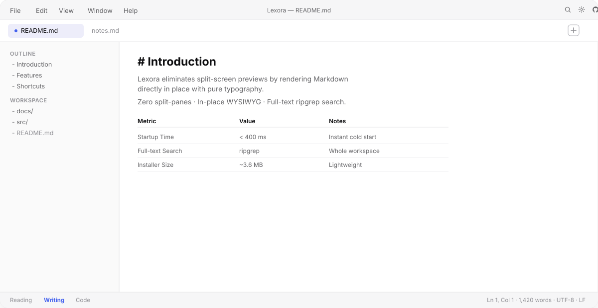

<div align="center">

[English](README.md) · [简体中文](README.zh-CN.md) · [繁體中文](README.zh-TW.md) · [日本語](README.ja.md) · [한국어](README.ko.md) · [Deutsch](README.de.md) · [Français](README.fr.md) · [Español](README.es.md) · [**Русский**](README.ru.md)


# ✨ Lexora

**Локальный, молниеносный Markdown-ридер и WYSIWYG-редактор в стиле Typora.**

<span style="font-size: 13px;">v0.1.3 выпущена · Открытый исходный код (AGPL-3.0)</span>

[](https://berryuiki.github.io/Lexora/)
[](https://github.com/BerryUIKI/Lexora/releases/latest)
[](LICENSE)
[](https://github.com/BerryUIKI/Lexora/releases)
[](https://github.com/BerryUIKI/Lexora/actions)
[](https://tauri.app)
[](https://www.rust-lang.org/)
[](https://www.solidjs.com/)

<p align="center">
  <b>🚀 Локальный доступ</b> • <b>⚡ Мгновенный запуск (&lt;400 мс)</b> • <b>📝 Без разделения экрана</b> • <b>🌐 9 языков</b> • <b>📦 Компактный (~3.6 МБ)</b>
</p>

[**📥 Скачать**](#-прямые-ссылки-на-скачивание) · [**🖥️ Предпросмотр интерфейса**](#-предпросмотр-интерфейса) · [**🌟 Возможности**](#-основные-возможности) · [**⌨️ Горячие клавиши**](#-горячие-клавиши) · [**📚 Документация**](#-документация) · [**🌐 Сайт**](https://berryuiki.github.io/Lexora/)

</div>

---

## 📖 Содержание

- [🖥️ Предпросмотр интерфейса](#-предпросмотр-интерфейса)
- [📥 Прямые ссылки на скачивание](#-прямые-ссылки-на-скачивание)
- [🌟 Основные возможности](#-основные-возможности)
- [💡 Почему Lexora?](#-почему-lexora)
- [⌨️ Горячие клавиши](#-горячие-клавиши)
- [🛠️ Архитектура и стек технологий](#-архитектура-и-стек-технологий)
- [💻 Настройка для разработчиков](#-настройка-для-разработчиков)
- [📚 Документация](#-документация)
- [🤝 Участие в разработке](#-участие-в-разработке)
- [💬 Сообщество и поддержка](#-сообщество-и-поддержка)
- [❤️ Благодарности](#-благодарности)
- [📄 Лицензия](#-лицензия)

---

## 🖥️ Предпросмотр интерфейса

Реальный взгляд на интерфейс Lexora — строка меню, несколько вкладок, боковая панель оглавления и редактирование WYSIWYG на месте, всё в одном окне. Никаких разделённых панелей, предпросмотра и отвлекающих элементов.

<p align="center">
  
</p>

> **Чтение** · **Письмо** · **Код** — три режима отображения, переключение одной клавишей (`Ctrl+/`).

---

## 📥 Прямые ссылки на скачивание

Выберите операционную систему и пакет:

- **Windows x86_64:** [Установщик (`.exe`)](https://github.com/BerryUIKI/Lexora/releases/latest/download/Lexora_Windows_x86_64.exe) · [MSI](https://github.com/BerryUIKI/Lexora/releases/latest/download/Lexora_Windows_x86_64.msi)
- **macOS Apple Silicon:** [DMG](https://github.com/BerryUIKI/Lexora/releases/latest/download/Lexora_macOS_aarch64.dmg)
- **macOS Intel:** [DMG](https://github.com/BerryUIKI/Lexora/releases/latest/download/Lexora_macOS_x86_64.dmg)
- **Linux x86_64:** [AppImage](https://github.com/BerryUIKI/Lexora/releases/latest/download/Lexora_Linux_x86_64.AppImage) · [Debian/Ubuntu (`.deb`)](https://github.com/BerryUIKI/Lexora/releases/latest/download/Lexora_Linux_x86_64.deb) · [Fedora/RHEL (`.rpm`)](https://github.com/BerryUIKI/Lexora/releases/latest/download/Lexora_Linux_x86_64.rpm)

[Все релизы и архивы исходного кода](https://github.com/BerryUIKI/Lexora/releases/latest).

---

## 📖 Введение

**Lexora** — это редактор и читалка Markdown с открытым исходным кодом для писателей, разработчиков и исследователей, которым нужна скорость обычного Markdown без когнитивной нагрузки от предпросмотра в разделённом экране.

Построенный на **Tauri 2** и **Rust** с тонкозернистым реактивным фронтендом **SolidJS**, Lexora сочетает нативную отзывчивость рабочего стола с минималистичной эстетикой без отвлекающих элементов.

---

## 🌟 Основные возможности

| Возможность | Преимущества | Статус |
|---|---|:---:|
| 🌐 **i18n на 9 языках** | Нативная поддержка **русского**, English, 简体中文, 繁體中文, 日本語, 한국어, Deutsch, Français, Español с автоматическим определением языка системы и переключением в рантайме | ✅ Готово |
| 🪟 **Нативный внешний вид окна** | Компактные пользовательские элементы управления в Windows/Linux, нативные «светофоры» в macOS | ✅ Готово |
| 🏷️ **Ассоциация `.md` в Windows** | Автоматическая регистрация `.md`, `.markdown`, `.mdx` и `.txt`; двойной клик в Проводнике для мгновенного открытия | ✅ Готово |
| 🔄 **Три режима отображения** | Переключение одной клавишей (`Ctrl+/`): **Чтение** (только просмотр), **Письмо** (WYSIWYG) и **Код** (исходник с синхронизацией номеров строк) | ✅ Готово |
| 📥 **Умное перетаскивание** | Перетащите файл в окно для открытия, на панель вкладок — для новой вкладки, в текст — для вставки форматированных ссылок | ✅ Готово |
| ✍️ **Форматирование на месте** | Форматируйте выделение стандартными сочетаниями (<kbd>Ctrl+B</kbd> жирный, <kbd>Ctrl+0</kbd> абзац, <kbd>Ctrl+1~6</kbd> заголовки) | ✅ Готово |
| 🔲 **Монохромный векторный интерфейс** | Минималистичные векторные SVG (`stroke="currentColor"`), адаптирующиеся к теме и не отвлекающие от текста | ✅ Готово |
| 💾 **Атомарное сохранение без сбоев** | Никогда не теряйте работу благодаря атомарной записи (`.tmp` -> переименование) и отслеживанию состояния изменений | ✅ Готово |
| 📂 **Рабочее пространство и вкладки** | Вкладки нескольких документов, рекурсивное дерево файлов с CRUD и быстрый переключатель (<kbd>Ctrl+P</kbd>) | ✅ Готово |
| 🌈 **Подсветка синтаксиса** | Высокопроизводительная подсветка через `syntect` с языковыми метками и кнопкой копирования | ✅ Готово |
| 📑 **Динамическое оглавление** | Интерактивный план документа с плавной прокруткой к якорям во всех режимах | ✅ Готово |
| 📊 **Диаграммы Mermaid и математика** | Интерактивные блок-схемы, диаграммы последовательностей и классов, формулы LaTeX | ✅ Готово |
| 🔍 **Полнотекстовый поиск Ripgrep** | Мгновенный поиск по всему рабочему пространству (<kbd>Ctrl+Shift+F</kbd>) и поиск/замена в документе (<kbd>Ctrl+F</kbd> / <kbd>Ctrl+H</kbd>) | ✅ Готово |
| 📤 **Автономный экспорт в HTML** | Экспорт любого документа в самодостаточный HTML с офлайн-стилем (<kbd>Ctrl+E</kbd>) | ✅ Готово |

*Что запланировано дальше — в [дорожной карте](docs/ROADMAP.md).*

---

## 💡 Почему Lexora?

| | Lexora | Редакторы с разделённым экраном | Онлайн-заметки |
|---|---|---|---|
| **Рендеринг** | WYSIWYG на месте, ноль панелей | Предпросмотр рядом | Переключение вкладок браузера |
| **Запуск** | < 400 мс нативный | зависит от веса Electron | Загрузка страницы + ожидание синхронизации |
| **Конфиденциальность** | 100 % локально, ноль телеметрии | Локальные файлы | Данные в облаке |
| **Размер** | ~3.6 МБ установщик | 100+ МБ установщики | Н/Д |
| **Офлайн** | Полностью офлайн | Полностью офлайн | Требуется сеть |
| **Формат хранения** | Чистый Markdown на диске | Возможны проприетарные форматы | Привязка к вендору |

Lexora хранит ваши документы как **чистый Markdown на диске** — переносимый, сравниваемый и навсегда ваш. Никакого облачного аккаунта, синхронизации и привязки.

---

## ⌨️ Горячие клавиши

| Категория | Сочетание | Действие |
|---|---|---|
| **Документ** | <kbd>Ctrl</kbd> + <kbd>N</kbd> | Новый документ |
| | <kbd>Ctrl</kbd> + <kbd>O</kbd> | Открыть файл... |
| | <kbd>Ctrl</kbd> + <kbd>Shift</kbd> + <kbd>O</kbd> | Открыть папку рабочего пространства... |
| | <kbd>Ctrl</kbd> + <kbd>S</kbd> | Сохранить текущий документ |
| | <kbd>Ctrl</kbd> + <kbd>Shift</kbd> + <kbd>S</kbd> | Сохранить как... |
| | <kbd>Ctrl</kbd> + <kbd>W</kbd> | Закрыть текущую вкладку |
| | <kbd>Ctrl</kbd> + <kbd>E</kbd> | Экспортировать в HTML... |
| **Правка** | <kbd>Ctrl</kbd> + <kbd>Z</kbd> / <kbd>Ctrl</kbd> + <kbd>Y</kbd> | Отменить / Повторить |
| | <kbd>Ctrl</kbd> + <kbd>B</kbd> | Полужирный |
| | <kbd>Ctrl</kbd> + <kbd>I</kbd> | Курсив |
| | <kbd>Ctrl</kbd> + <kbd>Shift</kbd> + <kbd>X</kbd> | Зачёркнутый |
| | <kbd>Ctrl</kbd> + <kbd>K</kbd> | Вставить / обернуть ссылку |
| | <kbd>Ctrl</kbd> + <kbd>`</kbd> | Встроенный код |
| | <kbd>Ctrl</kbd> + <kbd>0</kbd> | Обычный абзац |
| | <kbd>Ctrl</kbd> + <kbd>1</kbd> ~ <kbd>6</kbd> | Заголовок 1 ~ 6 |
| **Навигация и поиск** | <kbd>Ctrl</kbd> + <kbd>P</kbd> | Быстрый переключатель файлов |
| | <kbd>Ctrl</kbd> + <kbd>F</kbd> | Найти в документе |
| | <kbd>Ctrl</kbd> + <kbd>H</kbd> | Заменить в документе |
| | <kbd>Ctrl</kbd> + <kbd>Shift</kbd> + <kbd>F</kbd> | Искать по рабочему пространству |
| **Вид** | <kbd>Ctrl</kbd> + <kbd>/</kbd> | Сменить режим (Чтение / Письмо / Код) |
| | <kbd>Ctrl</kbd> + <kbd>Shift</kbd> + <kbd>B</kbd> | Показать/скрыть боковую панель (Файлы / План) |
| | <kbd>Ctrl</kbd> + <kbd>Shift</kbd> + <kbd>D</kbd> | Режим фокусировки (без отвлекающих элементов) |
| | <kbd>F11</kbd> / <kbd>Ctrl</kbd> + <kbd>Shift</kbd> + <kbd>Z</kbd> | Режим дзен (полный экран) |
| | <kbd>Ctrl</kbd> + <kbd>+</kbd> / <kbd>-</kbd> | Увеличить / уменьшить шрифт |
| | <kbd>Ctrl</kbd> + <kbd>0</kbd> (цифровая клавиатура) | Сбросить размер шрифта (16px) |

*(На macOS замените <kbd>Ctrl</kbd> на <kbd>Cmd</kbd>)*

---

## 🛠️ Архитектура и стек технологий

```
┌────────────────────────────────────────────────────────┐
│               Frontend (SolidJS + Webview)             │
│   • Reactive UI Components (MenuBar, Sidebar, Tabs)   │
│   • Editor Engine (Milkdown / ProseMirror WYSIWYG)     │
│   • Multi-language Engine (Solid Signals, 9 Locales)   │
│   • Typed IPC Wrappers (invoke / listen)               │
└──────────────────────────┬─────────────────────────────┘
                           │ IPC Bridge (JSON / Events)
┌──────────────────────────▼─────────────────────────────┐
│                 Backend (Rust Native App)              │
│   • State Management (Mutex<AppState>)                 │
│   • Native Update Checker (HTTPS Reqwest Client)       │
│   • Atomic File I/O & FS Watcher (notify crate)        │
│   • Zero-Copy AST Parser (pulldown-cmark)              │
│   • Code Syntax Highlighter (syntect)                  │
└────────────────────────────────────────────────────────┘
```

---

## 💻 Настройка для разработчиков

### Предварительные требования
* [Node.js](https://nodejs.org/) 20+
* [pnpm](https://pnpm.io/) 9+
* [Rust](https://rustup.rs/) 1.85+
* [Предварительные требования Tauri](https://v2.tauri.app/start/prerequisites/)

### Клонирование и локальный запуск
```bash
git clone https://github.com/BerryUIKI/Lexora.git
cd Lexora

# Установка зависимостей фронтенда
pnpm install

# Запуск локального dev-сервера Tauri
pnpm tauri dev
```

### Тесты и проверка
```bash
# Запуск всех Rust-юнит-тестов
cargo test --manifest-path src-tauri/Cargo.toml

# Строгая проверка типов TypeScript
pnpm tsc --noEmit

# Запуск юнит-тестов фронтенда (Vitest)
pnpm test
```

### Продакшен-сборка
```bash
# Сборка автономного исполняемого файла и установщиков ОС
pnpm tauri build
```

---

## 📚 Документация

| Документ | Описание |
|---|---|
| [ARCHITECTURE.md](docs/ARCHITECTURE.md) | Проектирование системы и потоки данных |
| [DESIGN_DECISIONS.md](docs/DESIGN_DECISIONS.md) | Журнал архитектурных решений (ADRs) |
| [DEVELOPMENT.md](docs/DEVELOPMENT.md) | Настройка среды и руководство по отладке |
| [CONTRIBUTING.md](docs/CONTRIBUTING.md) | Руководство по участию и соглашения |
| [COLLABORATION.md](docs/COLLABORATION.md) | Рабочий процесс команды и правила ревью |
| [ROADMAP.md](docs/ROADMAP.md) | Поэтапная дорожная карта и MoSCoW |
| [MILESTONES.md](docs/MILESTONES.md) | Вехи и график |
| [NEXT_STEPS.md](docs/NEXT_STEPS.md) | План реализации Фазы 2 |

---

## 🤝 Участие в разработке

Мы тепло приветствуем любой вклад — сообщения об ошибках, идеи функций, переводы и pull request.

1. Сделайте форк репозитория и создайте ветку от `dev`.
2. Следуйте [руководству по участию](docs/CONTRIBUTING.md) и [руководству по сотрудничеству](docs/COLLABORATION.md).
3. Соблюдайте формат [Conventional Commits](https://www.conventionalcommits.org/).
4. Откройте pull request в ветку `dev`.

Все сообщения коммитов следуют формату: `<type>(<scope>): <short summary>` — например, `feat(editor): integrate Milkdown core in-place WYSIWYG renderer`.

---

## 💬 Сообщество и поддержка

- 🐛 [Сообщить об ошибке / запросить функцию](https://github.com/BerryUIKI/Lexora/issues)
- 🌐 [Сайт](https://berryuiki.github.io/Lexora/)
- 💡 [Начать обсуждение](https://github.com/BerryUIKI/Lexora/discussions)
- 🔒 [Политика безопасности](https://github.com/BerryUIKI/Lexora/security)
- 📦 [Все релизы](https://github.com/BerryUIKI/Lexora/releases)

---

## ❤️ Благодарности

Lexora стоит на плечах этих замечательных проектов с открытым исходным кодом:

- [Tauri 2](https://tauri.app) — лёгкая и безопасная оболочка рабочего стола
- [Rust](https://www.rust-lang.org/) — безопасный по памяти нативный бэкенд
- [SolidJS](https://www.solidjs.com/) — тонкозернистый реактивный фронтенд
- [Milkdown](https://milkdown.dev) / [ProseMirror](https://prosemirror.net) — движок редактирования WYSIWYG
- [pulldown-cmark](https://github.com/pulldown-cmark/pulldown-cmark) — парсинг GFM AST без копирования
- [syntect](https://github.com/trishume/syntect) — подсветка синтаксиса
- [notify](https://github.com/notify-rs/notify) — слежение за файловой системой
- [ripgrep](https://github.com/BurntSushi/ripgrep) — полнотекстовый поиск
- [Mermaid](https://mermaid.js.org) — диаграммы
- [KaTeX](https://katex.org) — рендеринг математики
- [Tailwind CSS](https://tailwindcss.com) — утилитарные стили

---

## 📄 Лицензия

Этот проект распространяется под лицензией **GNU Affero General Public License v3.0 (AGPL-3.0)**. Подробности — в файле [LICENSE](LICENSE).

Если вы модифицируете Lexora и запускаете её как сетевой сервис, AGPL-3.0 требует предоставить пользователям модифицированный исходный код.
