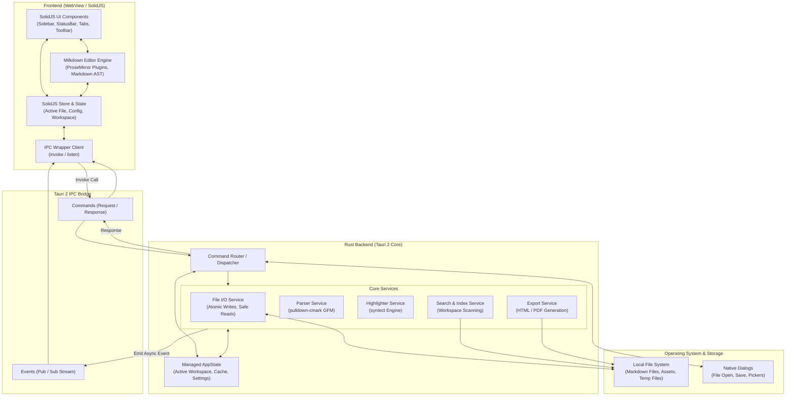
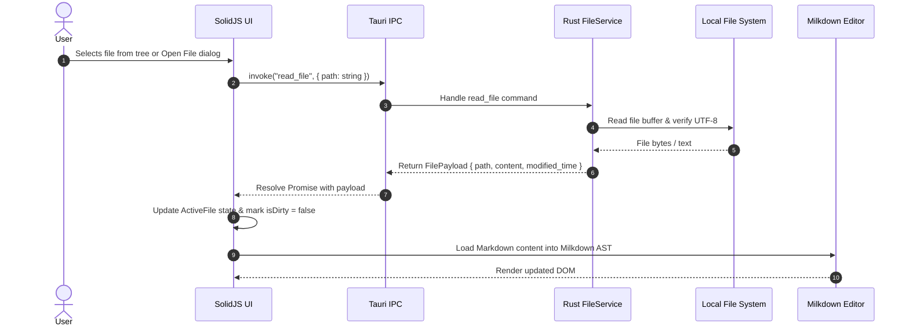
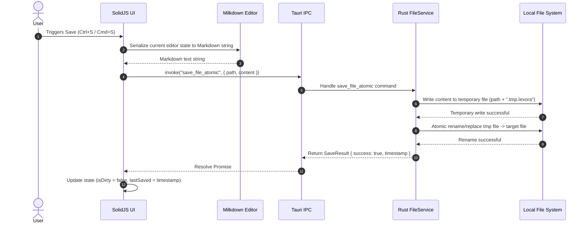

# Lexora Architecture

Lexora is a high-performance, seamless in-place WYSIWYG Markdown reader-editor built on **Tauri 2**, **Rust**, **SolidJS**, and **Milkdown**. This document outlines the technical architecture, component boundaries, data flows, security constraints, and performance goals of the application.

---

## 1. System Overview

Lexora utilizes a desktop application architecture separating user interface rendering and systems-level operations:

- **Frontend (WebView)**: Built with **SolidJS** and **Milkdown** (ProseMirror-based). Runs within the platform's native WebView (WebView2 on Windows, WebKit on macOS, WebKitGTK on Linux). Responsible for immediate user input handling, WYSIWYG Markdown rendering, editor state management, and user interface controls.
- **Backend (Rust Process)**: Built on the **Tauri 2** core. Responsible for native operating system interactions, secure file system access (atomic reads/writes), Markdown parsing/transformation for export, high-speed syntax highlighting with `syntect`, workspace indexing, and application configuration persistence.
- **Inter-Process Communication (IPC)**: Strongly typed communication layer utilizing Tauri Commands (invoke) for request-response interactions and Tauri Events (listen/emit) for asynchronous backend-driven notifications.

```
+-------------------------------------------------------------------------+
|                              Native Window                              |
|                                                                         |
|  +-------------------------------------------------------------------+  |
|  |                   SolidJS Frontend (WebView)                      |  |
|  |                                                                   |  |
|  |  +-------------------+ +-------------------+ +-----------------+  |  |
|  |  |   Sidebar / Nav   | |  Milkdown Editor  | |   Status Bar    |  |  |
|  |  +-------------------+ +-------------------+ +-----------------+  |  |
|  |            |                     |                    |           |  |
|  |            +---------------------+--------------------+           |  |
|  |                                  |                                |  |
|  |                        [ SolidJS Signal Store ]                   |  |
|  |                                  |                                |  |
|  |                       [ Typed IPC Wrapper lib ]                   |  |
|  +----------------------------------+--------------------------------+  |
|                                     |                                   |
|                        Tauri 2 IPC Bridge (JSON)                        |
|                                     |                                   |
|  +----------------------------------+--------------------------------+  |
|  |                        Rust Backend Core                          |  |
|  |                                                                   |  |
|  |  +-------------------+ +-------------------+ +-----------------+  |  |
|  |  |  Tauri Commands   | |    Tauri State    | |   Event Emitter |  |  |
|  |  +-------------------+ +-------------------+ +-----------------+  |  |
|  |            |                     |                    |           |  |
|  |  +-------------------+ +-------------------+ +-----------------+  |  |
|  |  |  File I/O Service | |   pulldown-cmark  | | syntect Engine  |  |  |
|  |  |  (Atomic Writes)  | |   Parser & Export | | (Highlighter)   |  |  |
|  |  +-------------------+ +-------------------+ +-----------------+  |  |
|  +----------------------------------+--------------------------------+  |
+-------------------------------------|-----------------------------------+
                                      |
                           Local File System & OS
```

---

## 2. Architecture Diagram (Mermaid)



---

## 3. Data Flow for Key Operations

### 3.1. Open File Flow


### 3.2. Save File (Atomic Write) Flow


### 3.3. Live Editing Flow
1. User types in the Milkdown editor surface.
2. ProseMirror transaction updates the internal schema document model in memory.
3. Milkdown triggers change listeners.
4. SolidJS store captures change event, sets `activeFile.isDirty = true`, and recalculates word/character counts.
5. Status bar reacts with zero-overhead SolidJS fine-grained signal subscriptions.

### 3.4. Code Syntax Highlighting Flow
1. For dynamic client-side rendering of inline/block code, standard Milkdown Prism/Shiki/highlight tokens run in the WebView.
2. For large code blocks, static preview, or Rust-side export pipelines, code blocks are routed to Rust's `syntect` engine via `invoke("highlight_code", { code, language, theme })` returning pre-highlighted HTML spans.

### 3.5. Export Flow (HTML / PDF)
1. User initiates Export (e.g. Export to HTML).
2. Frontend serializes current document or passes file path to Rust.
3. Rust backend invokes `pulldown-cmark` with GitHub Flavored Markdown (GFM) flags enabled (tables, task lists, strikethrough, footnotes).
4. Rust backend passes HTML fragments through template renderer, bundles styling and syntax-highlighted code blocks, and writes final artifact to disk or invokes native print/PDF generator.

---

## 4. Technology Stack

| Layer | Technology | Version / Specification | Rationale |
| :--- | :--- | :--- | :--- |
| **Desktop Shell** | Tauri | `v2.x` | Native OS integration, minimal memory footprint, tiny binary size, strong capability security model. |
| **Frontend Framework** | SolidJS | `v1.9+` | Fine-grained reactivity without Virtual DOM overhead; ideal for high-throughput editor interactions. |
| **Language (Frontend)** | TypeScript | `v5.x` | Strict type safety across UI components, stores, and IPC wrappers. |
| **Editor Core** | Milkdown | `v7.x` | ProseMirror-based WYSIWYG editor with first-class Markdown AST state. |
| **Styling** | Tailwind CSS | `v4.x` | Modern, utility-first CSS engine with dark/light mode CSS variable tokens. |
| **Frontend Tooling** | Vite | `v6.x` | Instant HMR, modern ESM bundling, fast build pipelines. |
| **Backend Language** | Rust | `2024 Edition (1.85+)` | Memory safety, zero-cost abstractions, native multithreading. |
| **Markdown Parser** | `pulldown-cmark` | `0.12+` | High-performance pull-parser for GFM, used in backend export and indexing. |
| **Syntax Highlighting** | `syntect` | `5.2+` | Fast, accurate Sublime-compatible syntax highlighter in pure Rust. |
| **Serialization** | `serde` / `serde_json` | `1.0+` | Type-safe JSON serialization for IPC payloads. |

---

## 5. Module Structure

### 5.1. Rust Backend (`src-tauri/`)

```
src-tauri/
├── Cargo.toml
├── tauri.conf.json
├── capabilities/
│   └── default.json          # Tauri v2 capability permissions
├── icons/                    # Application icons
└── src/
    ├── main.rs               # Application entry point
    ├── lib.rs                # App setup and command registrations
    ├── state.rs              # AppState definition and thread-safe containers
    ├── commands/             # Tauri IPC command handlers
    │   ├── mod.rs
    │   ├── editor.rs         # Markdown processing and parsing commands
    │   ├── file.rs           # File I/O, open, save, exists commands
    │   ├── highlight.rs      # Syntect syntax highlighting commands
    │   └── workspace.rs      # Directory traversal and file tree commands
    ├── models/               # Domain data structures (Serde-enabled)
    │   ├── mod.rs
    │   ├── file_item.rs      # File tree node representation
    │   ├── payload.rs        # IPC response/request wrappers
    │   └── settings.rs       # Editor and app settings schema
    └── services/             # Core business logic
        ├── mod.rs
        ├── atomic_writer.rs  # Safe file write implementation
        ├── exporter.rs       # Markdown to HTML/PDF transformation
        ├── highlighter.rs    # Syntect theme and syntax manager
        └── parser.rs         # pulldown-cmark wrapper
```

### 5.2. Frontend (`src/`)

```
src/
├── index.html
├── main.tsx                  # SolidJS root mount
├── App.tsx                   # Main application layout
├── vite-env.d.ts
├── assets/                   # Static assets & icons
├── components/               # SolidJS UI components
│   ├── editor/
│   │   ├── MilkdownEditor.tsx
│   │   └── EditorToolbar.tsx
│   ├── sidebar/
│   │   ├── FileTree.tsx
│   │   ├── FileItem.tsx
│   │   └── SidebarHeader.tsx
│   ├── statusbar/
│   │   ├── StatusBar.tsx
│   │   └── StatsDisplay.tsx
│   └── common/
│       ├── Button.tsx
│       ├── Dialog.tsx
│       └── Tooltip.tsx
├── lib/                      # Utilities and backend bridges
│   ├── tauri/
│   │   ├── commands.ts       # Typed Tauri invoke wrappers
│   │   ├── events.ts         # Typed Tauri event listeners
│   │   └── fs.ts             # File system client helper
│   ├── milkdown/
│   │   ├── plugins.ts        # Milkdown plugin configurations
│   │   └── theme.ts          # Editor theme integration
│   └── utils/
│       ├── platform.ts       # OS detection (macOS/Windows/Linux)
│       └── shortcuts.ts      # Keyboard shortcut manager
├── store/                    # SolidJS reactive stores & signals
│   ├── editorStore.ts        # Active file, dirty flag, cursor position
│   ├── workspaceStore.ts     # Workspace directory, expanded nodes
│   └── settingsStore.ts      # Theme, font size, auto-save settings
├── styles/                   # Stylesheets
│   ├── global.css            # Tailwind directives and base styles
│   ├── theme.css             # Light/dark mode CSS variables
│   └── typography.css        # Markdown document styling
└── types/                    # Shared TypeScript interfaces
    ├── file.ts               # FileItem, FilePayload, DirectoryTree
    ├── ipc.ts                # Command names and payload types
    └── settings.ts           # User preference types
```

---

## 6. IPC Design

Tauri 2 IPC provides a type-safe boundary between the WebView JavaScript runtime and the compiled Rust native runtime.

### 6.1. Commands (Request / Response)
Used for explicit user-initiated actions that require a direct response.

| Command Name | Arguments | Return Type | Description |
| :--- | :--- | :--- | :--- |
| `read_file` | `{ path: string }` | `FilePayload` | Reads content and metadata of a Markdown file. |
| `write_file_atomic` | `{ path: string, content: string }` | `WriteResult` | Atomically writes document to disk. |
| `read_directory` | `{ path: string, recursive?: boolean }` | `FileItem[]` | Traverses workspace directory tree. |
| `highlight_code` | `{ code: string, lang: string, theme?: string }` | `string` | Returns syntax-highlighted HTML string. |
| `parse_markdown` | `{ content: string }` | `string` | Parses Markdown to sanitized HTML via `pulldown-cmark`. |
| `get_app_settings` | `None` | `AppSettings` | Retrieves current application configuration. |
| `save_app_settings` | `{ settings: AppSettings }` | `void` | Persists updated application configuration. |

### 6.2. Events (Asynchronous Notifications)
Used for broadcasting state changes or background system events.

| Event Channel | Payload Type | Description |
| :--- | :--- | :--- |
| `lexora://file-changed` | `{ path: string, kind: string }` | Notifies when open file is modified externally. |
| `lexora://theme-changed` | `{ theme: "light" \| "dark" }` | Emitted on OS system theme transition. |
| `lexora://menu-action` | `{ action: string }` | Emitted when native application menu item is clicked. |

---

## 7. Security Model

Lexora adheres to strict **least-privilege** security practices enabled by Tauri v2:

1. **Capability Scopes**:
   - Explicit permissions defined in `src-tauri/capabilities/default.json`.
   - File system access is restricted to user-opened files and designated workspace directories. Arbitrary system-level file access is denied by default.
2. **Content Security Policy (CSP)**:
   - Rigid CSP defined in `tauri.conf.json` preventing arbitrary remote script injection, inline execution of untrusted scripts, and external network calls.
   - `default-src 'self'; script-src 'self'; style-src 'self' 'unsafe-inline'; img-src 'self' asset: https: data:; font-src 'self' data:;`
3. **Rust Memory & Input Validation**:
   - All paths received via IPC are sanitized and canonicalized to prevent path traversal attacks (`../` exploits).
   - Atomic writes prevent partial file truncation and race conditions.

---

## 8. Performance Targets

| Metric | Target | Measurement Strategy |
| :--- | :--- | :--- |
| **Cold Startup Time** | `< 1000ms` | Time from process launch to interactive editor render. |
| **Warm Startup Time** | `< 400ms` | Time to restore window and load previous session. |
| **Keystroke Latency** | `< 16ms` (60fps) | Time from keyboard event to ProseMirror DOM flush. |
| **File Open (1MB Markdown)** | `< 200ms` | Read from disk, IPC transfer, AST generation, and DOM paint. |
| **Memory Footprint (Idle)** | `< 90MB` | Total working set across WebView and Rust backend processes. |
