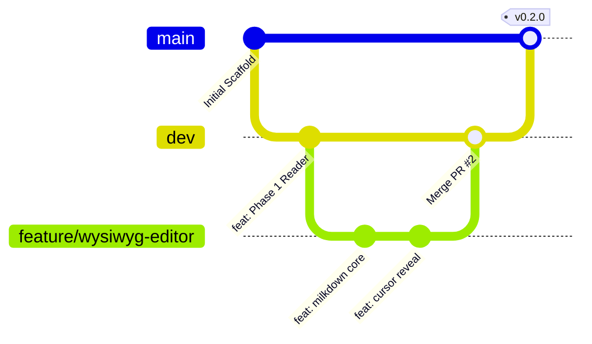

# Taleno — Collaboration & Engineering Handbook

This guide outlines our engineering standards, Git workflow, review protocols, and collaboration processes for the **Taleno** project.

---

## 🧭 Core Principles

1. **Local-First & Data Sovereignty**: All document operations occur on disk. No telemetry, cloud traps, or opaque databases.
2. **Native Performance**: Memory safety and compute-heavy tasks belong in Rust; UI reactivity belongs in SolidJS. Keystroke latency must remain under 16ms.
3. **Clean Separation of Concerns**: Keep IPC boundaries strict. Frontend handles reactive DOM updates; Rust handles file I/O, parsing, indexing, and process management.
4. **Incremental Delivery**: Work in small, well-tested commits backed by Conventional Commits.

---

## 🌿 Branching Strategy

We follow a GitFlow-inspired model optimized for fast, safe iterations:



### Branch Definitions

| Branch | Purpose | Protection Rules |
|---|---|---|
| `main` | Production-ready stable code. Reflects latest release tags (`v0.1.0`, etc.). | Strict PR required. Must pass all unit/E2E tests and production build. |
| `dev` | Primary integration branch for active development. | PR or reviewed commits. Must pass all automated checks. |
| `feature/<name>` | New feature branches branched from `dev`. | Merged into `dev` via Pull Request after review. |
| `fix/<name>` | Bug fixes branched from `dev` (or `main` for hotfixes). | Merged into `dev` (and cherry-picked to `main` if hotfix). |
| `docs/<name>` | Documentation updates. | Merged into `dev`. |
| `refactor/<name>`| Code cleanup or performance optimizations without feature changes. | Merged into `dev`. |

---

## 🌐 Ecosystem Separation: Taleno vs Taleno-Plugins

Taleno maintains a strict separation of concerns across two official repositories:

1. **[`BerryUIKI/Taleno`](https://github.com/BerryUIKI/Taleno)** (This Repository):
   - Reserved strictly for core desktop software development, native backend services, UI components, and built-in features.
   - Houses **Built-in Themes** (e.g. `Taleno`, `GitHub`, `Solarized`), which require zero installation and cannot be uninstalled via the GUI.
2. **[`BerryUIKI/Taleno-Plugins`](https://github.com/BerryUIKI/Taleno-Plugins)**:
   - Dedicated community hub for **External Plugins** and **External Themes/Skins**.
   - External themes and plugins can be freely installed, applied, or uninstalled by users via options in the GUI.
   - All third-party plugins and external themes **MUST** be submitted as Pull Requests to `BerryUIKI/Taleno-Plugins`, never to this repository.

---

## ✍️ Commit Conventions

We strictly enforce the **Conventional Commits 1.0.0** specification:

```
<type>(<scope>): <short summary>

[optional body explaining rationale, non-obvious design decisions, or context]

[optional footer(s), e.g., Closes #123]
```

### Allowed Types

- `feat`: A new user-facing feature or capability.
- `fix`: A bug fix.
- `docs`: Documentation only changes.
- `style`: Changes that do not affect the meaning of code (formatting, semicolon fixes, etc.).
- `refactor`: Code change that neither fixes a bug nor adds a feature.
- `perf`: Code change that improves performance.
- `test`: Adding missing tests or correcting existing tests.
- `chore`: Changes to build process, tooling, or package dependencies.

### Example Commits

```bash
feat(editor): integrate Milkdown core in-place WYSIWYG renderer
fix(watcher): prevent duplicate reload banner on consecutive rapid writes
docs(milestones): add Phase 2 acceptance criteria and delivery dates
perf(parser): optimize AST heading extraction with zero-copy string slices
```

---

## 🔄 Pull Request & Review Protocol

### 1. PR Creation Checklist
Before opening a PR from your feature branch to `dev`:
- [ ] Code passes all Rust tests: `cargo test --manifest-path src-tauri/Cargo.toml`
- [ ] Code passes TypeScript check: `pnpm tsc --noEmit`
- [ ] Frontend builds cleanly: `pnpm build`
- [ ] New functionality is covered with unit or E2E tests where applicable.
- [ ] Documentation has been updated to reflect architectural or user-facing changes.

### 2. PR Review Criteria
Reviewers evaluate PRs based on:
1. **Security**: Are Tauri capabilities scoped strictly with least privilege? No arbitrary shell executions or unsanitized HTML injections.
2. **Performance**: Does the change introduce main-thread jank, unnecessary allocations, or heavy IPC payloads?
3. **Robustness**: Are errors handled via `Result<T, E>` on Rust and handled gracefully in the SolidJS UI?
4. **Code Clarity**: Are public APIs, commands, and non-trivial algorithms documented with docstrings?

---

## 🏷️ Release Management & SemVer

Taleno follows **Semantic Versioning (SemVer 2.0.0)**: `MAJOR.MINOR.PATCH`.

### Multi-Platform Release Track & Git Tag Conventions

To accommodate different release cadences, App Store review cycles, and platform-specific hotfixes without separating into multiple repositories, Taleno uses **Platform-Split Git Tags**:

| Platform Target | Git Tag Format | Example | Target Artifacts |
| :--- | :--- | :--- | :--- |
| **PC / Desktop** (macOS, Windows, Linux) | `vX.Y.Z` | `v0.2.0` | `.dmg`, `.msi`, `.exe`, `.deb`, `.AppImage` |
| **Android** (Google Play, Direct APK) | `vX.Y.Z-android` | `v0.1.9-android` | `app-universal-release.aab`, `.apk` |
| **iOS** (App Store, TestFlight) | `vX.Y.Z-ios` | `v0.1.9-ios` | `.ipa`, TestFlight archive |

### Release Workflow
1. Cut release branch from `dev` (e.g., `release/v0.2.0` or `release/v0.1.9-android`).
2. Update versions:
   - For Desktop: bump `package.json`, `src-tauri/Cargo.toml`, and `src-tauri/tauri.conf.json`.
   - For Android: increment `versionCode` in Gradle / `bundle.android` and update version string.
   - For iOS: increment `CFBundleVersion` in Xcode / `bundle.iOS` and update version string.
3. Update `CHANGELOG.md` with release notes under `## [vX.Y.Z(-platform)] - YYYY-MM-DD`.
4. Merge release branch into `main` and tag according to the platform convention:
   - Desktop: `git tag -a v0.2.0 -m "Release v0.2.0"`
   - Android: `git tag -a v0.1.9-android -m "Release Android v0.1.9"`
   - iOS: `git tag -a v0.1.9-ios -m "Release iOS v0.1.9"`
5. Merge `main` back into `dev` to keep history aligned.
6. Push tag to GitHub to trigger the corresponding platform CI/CD release workflow.

---

## 🛠️ RFC (Request for Comments) Process

For significant architectural changes (e.g., changing editor frameworks, redesigning IPC communication, adding plugin systems):

1. Create a markdown proposal in `docs/rfcs/0000-proposal-name.md`.
2. Detail the Problem Statement, Proposed Solution, Alternatives Considered, and Downside/Risks.
3. Open a GitHub Discussion / Issue labeled `RFC` to gather feedback from maintainers and collaborators before writing code.
