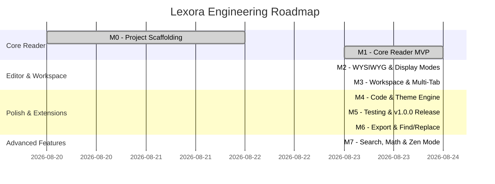

# Lexora — Project Milestones & Release Schedule

This document tracks the strategic milestones, deliverables, acceptance criteria, and progress for **Lexora** — the Typora-style Markdown reader-editor built on **Tauri 2 + Rust + SolidJS**.

---

## 🎯 Milestone Overview

---

## 📌 Milestone Details

### Milestone 0: Scaffolding & Foundation (v0.0.1)
- **Status**: ✅ Completed
- **Target Date**: 2026-08-22
- **Objective**: Establish the dual-runtime architecture, module layout, toolchain pipelines, and security sandboxing.
- **Key Deliverables**:
  - [x] Tauri 2 configuration with capability-based security permissions (`capabilities/default.json`).
  - [x] Rust backend module structure (`commands`, `models`, `services`, `state`).
  - [x] SolidJS + TypeScript + Vite 6 + Tailwind CSS 4 frontend pipeline.
  - [x] IPC bridge contract for commands and asynchronous event streaming.
  - [x] GitHub Actions CI/CD workflows and automated release packager (`.github/workflows/`).

---

### Milestone 1: Core Reader MVP (v0.1.0)
- **Status**: ✅ Completed
- **Target Date**: 2026-08-24
- **Objective**: Deliver a high-performance, native Markdown reader with GFM parsing, TOC navigation, and file system awareness.
- **Key Deliverables**:
  - [x] Resizable 3-part viewport (TOC Sidebar, Main Viewport, Status Bar).
  - [x] Native file open dialog supporting `.md`, `.markdown`, `.mdx`, and `.txt`.
  - [x] Fast AST parsing and word count in Rust via `pulldown-cmark`.
  - [x] Interactive Table of Contents with automatic heading anchor generation and smooth scroll.
  - [x] Asynchronous background file watcher (`notify`) detecting external edits.
  - [x] Tokyo Night-inspired dark/light theme switching with OS detection.

---

### Milestone 2: In-Place WYSIWYG Editing & Tri-State Display Modes (v0.2.0)
- **Status**: ✅ Completed
- **Target Date**: 2026-08-24
- **Objective**: Introduce Typora-style seamless inline Markdown editing and three rapidly toggleable display modes.
- **Key Deliverables**:
  - [x] **Tri-State Display Mode Switcher** (Status bar toggle & shortcut <kbd>Ctrl+/</kbd>):
    - 📖 **Reading**: Read-only rendering of GFM Markdown text.
    - ✍️ **Writing**: In-place live WYSIWYG editing.
    - 💻 **Code**: Raw Markdown source code view with line numbers.
  - [x] Milkdown v7 editor integration inside SolidJS lifecycle.
  - [x] ProseMirror undo/redo transaction history stack (<kbd>Ctrl+Z</kbd> / <kbd>Ctrl+Y</kbd>).
  - [x] Native atomic document saving (<kbd>Ctrl+S</kbd>) with `.tmp` rename pattern.
  - [x] Dirty document state tracking and unsaved changes confirmation.

---

### Milestone 3: Workspace & Multi-Document Tabs (v0.3.0)
- **Status**: ✅ Completed
- **Target Date**: 2026-08-24
- **Objective**: Enable multi-document management and folder-based workspace browsing.
- **Key Deliverables**:
  - [x] "Open Folder" workspace root browser with asynchronous recursive directory tree.
  - [x] Workspace tree item creation, deletion, and renaming.
  - [x] Multi-tab document bar with dirty indicators and close buttons.
  - [x] Quick file switcher palette (<kbd>Ctrl+P</kbd>) for instant workspace navigation.

---

### Milestone 4: Code Syntax & Theme Engine (v0.4.0)
- **Status**: ✅ Completed
- **Target Date**: 2026-08-24
- **Objective**: High-fidelity code block styling and rich metadata status bar.
- **Key Deliverables**:
  - [x] Rust `syntect` code syntax highlighting with language badges.
  - [x] Copy-to-clipboard button on fenced code blocks.
  - [x] Expanded status bar with word count, character count, UTF-8 encoding, and LF/CRLF detection.

---

### Milestone 5: MVP Release & Test Suite (v1.0.0)
- **Status**: ✅ Completed
- **Target Date**: 2026-08-24
- **Objective**: Comprehensive automated test suites and capability security audit.
- **Key Deliverables**:
  - [x] Vitest reactive store unit tests (`editor.test.ts`, `files.test.ts`, `settings.test.ts`).
  - [x] Rust backend test suite covering parser, syntect highlighter, atomic file I/O, and directory scanner.
  - [x] Tauri v2 least-privilege capability lockdown.

---

### Milestone 6: Rich Content & Export Engine (v1.1.0)
- **Status**: ✅ Completed
- **Target Date**: 2026-08-24
- **Objective**: In-document search, standalone export engine, and formatting toolbar.
- **Key Deliverables**:
  - [x] In-document Find & Replace with Regex and match navigation (<kbd>Ctrl+F</kbd>, <kbd>Ctrl+H</kbd>).
  - [x] Standalone self-contained HTML and print export engine via Rust (`export_document`).
  - [x] Quick Markdown formatting toolbar for tables, images, blockquotes, headings, and lists.
  - [x] Background auto-save timer for modified documents.

---

### Milestone 7: Advanced Features (v1.2.0)
- **Status**: ✅ Completed
- **Target Date**: 2026-08-24
- **Objective**: Full-text workspace search, live diagrams, math formulas, and Zen mode.
- **Key Deliverables**:
  - [x] Global workspace-wide full-text search modal (<kbd>Ctrl+Shift+F</kbd>).
  - [x] Live Mermaid.js diagram container rendering for `mermaid` code blocks.
  - [x] KaTeX math formula block wrappers for `$$...$$`.
  - [x] Zen Mode distraction-free editor (<kbd>F11</kbd> / <kbd>Ctrl+Shift+Z</kbd>).
  - [x] Focus Mode active block styling (<kbd>Ctrl+Shift+X</kbd>).

---

## 📊 Milestone Tracking Matrix

| Milestone | Version | Core Focus | Target Platform | Test Coverage Target | Status |
|---|---|---|---|---|---|
| **M0** | `v0.0.1` | Scaffolding & CI | Windows, macOS, Linux | N/A (Scaffold) | ✅ Done |
| **M1** | `v0.1.0` | Reader MVP | Windows (x64) | > 85% Backend | ✅ Done |
| **M2** | `v0.2.0` | WYSIWYG & Display Modes | Windows, macOS, Linux | > 80% Full Stack | ✅ Done |
| **M3** | `v0.3.0` | Multi-Tab & Workspace | Windows, macOS, Linux | > 80% Full Stack | ✅ Done |
| **M4** | `v0.4.0` | Syntax & Status Bar | Windows, macOS, Linux | > 85% Full Stack | ✅ Done |
| **M5** | `v1.0.0` | MVP Testing & Lockdown | Windows, macOS, Linux | > 90% Full Stack | ✅ Done |
| **M6** | `v1.1.0` | Export & Find/Replace | Windows, macOS, Linux | > 90% Full Stack | ✅ Done |
| **M7** | `v1.2.0` | Search, Diagrams & Zen | Windows, macOS, Linux | > 90% Full Stack | ✅ Done |
