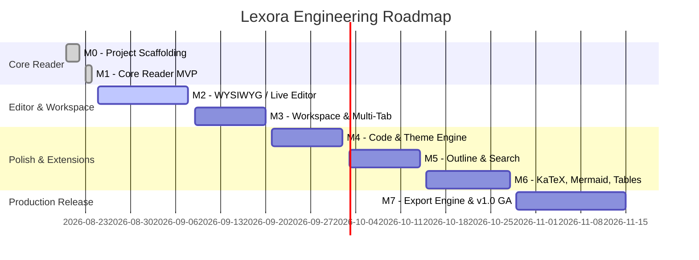

# Lexora — Project Milestones & Release Schedule

This document tracks the strategic milestones, deliverables, acceptance criteria, and progress for **Lexora** — the Typora-style Markdown reader-editor built on **Tauri 2 + Rust + SolidJS**.

---

## 🎯 Milestone Overview

---

## 📌 Milestone Details

### Milestone 0: Scaffolding & Foundation (v0.0.1)
- **Status**: ✅ Completed
- **Target Date**: 2026-08-22
- **Objective**: Establish the dual-runtime architecture, module layout, toolchain pipelines, and security sandboxing.
- **Key Deliverables**:
  - [x] Tauri 2 configuration with capability-based security permissions (`capabilities/default.json`).
  - [x] Rust backend module structure (`commands`, `models`, `services`, `state`).
  - [x] SolidJS + TypeScript + Vite 6 + Tailwind CSS 4 frontend pipeline.
  - [x] IPC bridge contract for commands and asynchronous event streaming.
  - [x] CI/CD test baseline and branch protection model (`main` / `dev`).

---

### Milestone 1: Core Reader MVP (v0.1.0)
- **Status**: ✅ Completed
- **Target Date**: 2026-08-24
- **Objective**: Deliver a high-performance, native Markdown reader with GFM parsing, TOC navigation, and file system awareness.
- **Key Deliverables**:
  - [x] Resizable 3-part viewport (TOC Sidebar, Main Viewport, Status Bar).
  - [x] Native file open dialog supporting `.md`, `.markdown`, `.mdx`, and `.txt`.
  - [x] Fast AST parsing and word count in Rust via `pulldown-cmark`.
  - [x] Interactive Table of Contents with automatic heading anchor generation and smooth scroll.
  - [x] Asynchronous background file watcher (`notify`) detecting external edits.
  - [x] Tokyo Night-inspired dark/light theme switching with OS detection.
  - [x] Production bundling: Standalone `.exe`, NSIS installer (3.38 MB), WiX MSI (4.92 MB).

---

### Milestone 2: In-Place WYSIWYG Editing (v0.2.0)
- **Status**: 🎯 In Progress (Active Milestone)
- **Target Date**: 2026-09-08
- **Objective**: Introduce Typora-style seamless inline Markdown editing without split panes.
- **Key Deliverables**:
  - [ ] Integrate Milkdown (ProseMirror-based) vanilla core inside SolidJS lifecycle.
  - [ ] Implement node-level "reveal syntax on cursor focus / render on blur" mechanism.
  - [ ] ProseMirror undo/redo transaction history stack.
  - [ ] Standard keyboard formatting shortcuts (<kbd>Ctrl+B</kbd>, <kbd>Ctrl+I</kbd>, <kbd>Ctrl+K</kbd>, <kbd>Ctrl+1..6</kbd>).
  - [ ] Native atomic document saving (`write-to-tmp` + `rename`) to prevent data corruption.
  - [ ] Dirty document state tracking and unsaved changes confirmation dialog.

---

### Milestone 3: Workspace & Multi-Document Tabs (v0.3.0)
- **Status**: ⏳ Planned
- **Target Date**: 2026-09-20
- **Objective**: Enable multi-document management and folder-based workspace browsing.
- **Key Deliverables**:
  - [ ] "Open Folder" workspace root browser with asynchronous recursive directory tree.
  - [ ] Multi-tab document bar with drag reordering, dirty indicators, and close guards.
  - [ ] Quick file switcher palette (<kbd>Ctrl+P</kbd>) for instant workspace navigation.
  - [ ] Recent files and workspaces history persisted in backend SQLite/settings store.

---

### Milestone 4: Code Syntax & Custom Theme Engine (v0.4.0)
- **Status**: ⏳ Planned
- **Target Date**: 2026-10-02
- **Objective**: High-fidelity code block styling and user-extensible theme system.
- **Key Deliverables**:
  - [ ] Rust `syntect` code syntax highlighting with language auto-detection and line numbers.
  - [ ] Copy-to-clipboard button on fenced code blocks.
  - [ ] User-loadable custom CSS themes placed in `~/.config/lexora/themes/`.
  - [ ] Typography adjustments: font family, font size, line height, and editor width preferences.

---

### Milestone 5: Outline Navigation & Full-Text Search (v0.5.0)
- **Status**: ⏳ Planned
- **Target Date**: 2026-10-14
- **Objective**: Fast in-document and cross-workspace search with advanced navigation.
- **Key Deliverables**:
  - [ ] In-document Find & Replace bar with Regex, case sensitivity, and whole-word filters (<kbd>Ctrl+F</kbd> / <kbd>Ctrl+H</kbd>).
  - [ ] Workspace-wide full-text ripgrep-style search engine in Rust.
  - [ ] Interactive collapsible document outline tree with live heading sync while scrolling.

---

### Milestone 6: Rich Content Extensions (v0.6.0)
- **Status**: ⏳ Planned
- **Target Date**: 2026-10-28
- **Objective**: Expand formatting capabilities for technical, scientific, and academic writing.
- **Key Deliverables**:
  - [ ] KaTeX mathematical formula rendering (inline `$..$` and block `$$..$$`).
  - [ ] Mermaid.js dynamic diagram rendering (flowcharts, sequence diagrams, mindmaps).
  - [ ] Interactive GFM table editor (add/remove rows & columns via context menu / keyboard).
  - [ ] Image drag-and-drop & clipboard paste with auto-asset saving to relative `./assets/` folder.

---

### Milestone 7: Export Engine & General Availability (v1.0.0)
- **Status**: ⏳ Planned
- **Target Date**: 2026-11-15
- **Objective**: High-quality document export, cross-platform certification, and production v1.0 release.
- **Key Deliverables**:
  - [ ] Export to PDF with custom CSS page styling, headers, and footers.
  - [ ] Export to standalone HTML with embedded styles and images.
  - [ ] Export to Docx / EPUB via Pandoc integration bridge.
  - [ ] Cross-platform release matrix: Windows (MSI/NSIS/portable), macOS (DMG/app), Linux (AppImage/deb).
  - [ ] Complete user documentation, tutorials, and plugin API specification.

---

## 📊 Milestone Tracking Matrix

| Milestone | Version | Core Focus | Target Platform | Test Coverage Target | Status |
|---|---|---|---|---|---|
| **M0** | `v0.0.1` | Scaffolding & CI | Windows, macOS, Linux | N/A (Scaffold) | ✅ Done |
| **M1** | `v0.1.0` | Reader MVP | Windows (x64) | > 85% Backend | ✅ Done |
| **M2** | `v0.2.0` | WYSIWYG Editing | Windows, macOS | > 80% Full Stack | 🎯 Active |
| **M3** | `v0.3.0` | Multi-Tab & Workspace | Windows, macOS, Linux | > 80% Full Stack | ⏳ Planned |
| **M4** | `v0.4.0` | Syntax & Themes | Windows, macOS, Linux | > 85% Full Stack | ⏳ Planned |
| **M5** | `v0.5.0` | Search & Outline | Windows, macOS, Linux | > 85% Full Stack | ⏳ Planned |
| **M6** | `v0.6.0` | KaTeX & Mermaid | Windows, macOS, Linux | > 85% Full Stack | ⏳ Planned |
| **M7** | `v1.0.0` | Export & GA | Windows, macOS, Linux | > 90% Full Stack | ⏳ Planned |
