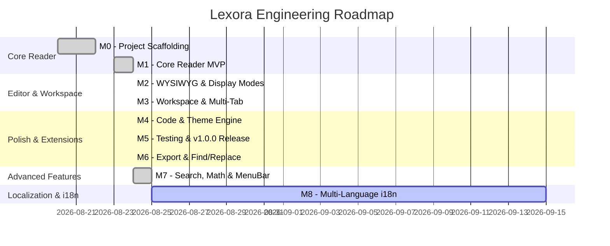

# Lexora — Project Milestones & Release Schedule

This document tracks the strategic milestones, deliverables, acceptance criteria, and progress for **Lexora** — the seamless in-place Markdown reader-editor built on **Tauri 2 + Rust + SolidJS**.

---

## 🎯 Milestone Overview

---

## 📌 Milestone Details

### Milestone 0: Scaffolding & Foundation (v0.0.1)
- **Status**: ✅ Completed
- **Target Date**: 2026-08-22
- **Objective**: Establish the dual-runtime architecture, module layout, toolchain pipelines, and security sandboxing.
- **Key Deliverables**:
  - [x] Tauri 2 configuration with capability-based security permissions (`capabilities/default.json`).
  - [x] Rust backend module structure (`commands`, `models`, `services`, `state`).
  - [x] SolidJS + TypeScript + Vite 6 + Tailwind CSS 4 frontend pipeline.
  - [x] IPC bridge contract for commands and asynchronous event streaming.
  - [x] GitHub Actions CI/CD workflows and automated release packager (`.github/workflows/`).

---

### Milestone 1: Core Reader MVP (v0.1.0)
- **Status**: ✅ Completed
- **Target Date**: 2026-08-24
- **Objective**: Deliver a high-performance, native Markdown reader with GFM parsing, TOC navigation, and file system awareness.
- **Key Deliverables**:
  - [x] Resizable 3-part viewport (TOC Sidebar, Main Viewport, Status Bar).
  - [x] Native file open dialog supporting `.md`, `.markdown`, `.mdx`, and `.txt`.
  - [x] Fast AST parsing and word count in Rust via `pulldown-cmark`.
  - [x] Interactive Table of Contents with automatic heading anchor generation and smooth scroll.
  - [x] Asynchronous background file watcher (`notify`) detecting external edits.
  - [x] Tokyo Night-inspired dark/light theme switching with OS detection.

---

### Milestone 2: In-Place WYSIWYG Editing & Tri-State Display Modes (v0.2.0)
- **Status**: ✅ Completed
- **Target Date**: 2026-08-24
- **Objective**: Introduce seamless inline Markdown editing and three rapidly toggleable display modes.
- **Key Deliverables**:
  - [x] **Tri-State Display Mode Switcher** (Status bar toggle & shortcut <kbd>Ctrl+/</kbd>):
    - 📖 **Reading**: Read-only rendering of GFM Markdown text.
    - ✍️ **Writing**: In-place live WYSIWYG editing.
    - 💻 **Code**: Raw Markdown source code view with line numbers.
  - [x] Milkdown v7 editor integration inside SolidJS lifecycle.
  - [x] ProseMirror undo/redo transaction history stack (<kbd>Ctrl+Z</kbd> / <kbd>Ctrl+Y</kbd>).
  - [x] Native atomic document saving (<kbd>Ctrl+S</kbd>) with `.tmp` rename pattern.
  - [x] Dirty document state tracking and unsaved changes confirmation.

---

### Milestone 3: Workspace & Multi-Document Tabs (v0.3.0)
- **Status**: ✅ Completed
- **Target Date**: 2026-08-24
- **Objective**: Enable multi-document management and folder-based workspace browsing.
- **Key Deliverables**:
  - [x] "Open Folder" workspace root browser with asynchronous recursive directory tree.
  - [x] Workspace tree item creation, deletion, and renaming.
  - [x] Multi-tab document bar with dirty indicators and close buttons.
  - [x] Quick file switcher palette (<kbd>Ctrl+P</kbd>) for instant workspace navigation.

---

### Milestone 4: Code Syntax & Theme Engine (v0.4.0)
- **Status**: ✅ Completed
- **Target Date**: 2026-08-24
- **Objective**: High-fidelity code block styling and rich metadata status bar.
- **Key Deliverables**:
  - [x] Rust `syntect` code syntax highlighting with language badges.
  - [x] Copy-to-clipboard button on fenced code blocks.
  - [x] Expanded status bar with word count, character count, UTF-8 encoding, and LF/CRLF detection.

---

### Milestone 5: MVP Release & Test Suite (v1.0.0)
- **Status**: ✅ Completed
- **Target Date**: 2026-08-24
- **Objective**: Comprehensive automated test suites and capability security audit.
- **Key Deliverables**:
  - [x] End-to-end and unit test matrix covering Rust and SolidJS layers (Vitest + `cargo test`).
  - [x] Tauri v2 capabilities security review.
  - [x] Automated GitHub Actions multi-platform release CI/CD workflow.

---

### Milestone 6: Productivity & Search Utilities (v1.1.0)
- **Status**: ✅ Completed
- **Target Date**: 2026-08-24
- **Objective**: In-document Find & Replace, document export, and background auto-save.
- **Key Deliverables**:
  - [x] In-document Find & Replace (<kbd>Ctrl+F</kbd>, <kbd>Ctrl+H</kbd>).
  - [x] Standalone HTML document export engine (`export_document`).
  - [x] Formatting toolbar for tables, blockquotes, headings, lists, and links.
  - [x] Background auto-save timer for active dirty files.

---

### Milestone 7: Advanced Rendering, MenuBar & Navigation (v1.2.0)
- **Status**: ✅ Completed
- **Target Date**: 2026-08-25
- **Objective**: Visual diagram support, mathematical expressions, VS Code-style MenuBar, and Windows shell integration.
- **Key Deliverables**:
  - [x] KaTeX mathematical formula rendering for `$$...$$` blocks.
  - [x] Mermaid.js live diagram rendering container.
  - [x] Zen Mode (<kbd>F11</kbd>) and Focus Mode (<kbd>Ctrl+Shift+D</kbd>).
  - [x] Global workspace full-text search (<kbd>Ctrl+Shift+F</kbd>).
  - [x] VS Code-style top in-app Menu Bar with File, Edit, View, Window, Help menus.
  - [x] Windows default `.md` file associations and CLI startup argument opening.
  - [x] Official GitHub repository integration ([BerryUIKI/Lexora](https://github.com/BerryUIKI/Lexora)).

---

### Milestone 8: Multi-Language Internationalization (i18n) (v1.3.0)
- **Status**: 🔄 In Progress
- **Target Date**: 2026-09-15
- **Objective**: Provide comprehensive multi-lingual UI localization for global users.
- **Key Deliverables**:
  - [ ] SolidJS reactive i18n locale store with auto-detection and persistence.
  - [ ] Complete language dictionaries for English (`en`), Simplified Chinese (`zh-CN`), Traditional Chinese (`zh-TW`), Japanese (`ja`), German (`de`), French (`fr`), and Spanish (`es`).
  - [ ] In-app language switcher accessible via top Menu Bar and Settings.
  - [ ] Localized shortcut tooltips, dialogs, error messages, and documentation references.
