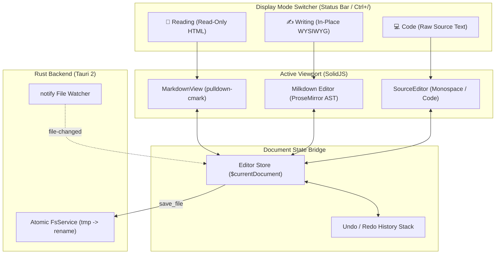

# Taleno — Next Steps: Phase 2 Execution Plan

This document outlines the concrete technical strategy, task breakdown, risk assessment, and implementation plan for **Phase 2 — In-Place WYSIWYG Editor & Tri-State Display Modes**.

---

## 🎯 Phase 2 Objectives

Transform Taleno from a Markdown reader into a full-featured **seamless in-place Markdown environment with Three Display Modes**:
1. **Three Display Modes** (rapidly toggled via status bar or shortcuts):
   - 📖 **Reading Mode**: Clean, read-only rendered Markdown view for distraction-free reading and review.
   - ✍️ **Writing Mode**: In-place WYSIWYG editing where Markdown syntax renders live as you type, and raw delimiters reveal only on cursor focus.
   - 💻 **Code Mode**: Direct plain-text raw Markdown source editing with monospace typography and line numbers.
2. **Seamless inline editing** without split panes or visual clutter.
3. **Full editing capabilities**: typing, keyboard shortcuts, inline formatting, and undo/redo history.
4. **Lossless bi-directional roundtripping** between on-disk Markdown and in-memory document state.
5. **Atomic document saving** with dirty-state tracking, unsaved change guards, and quick save (<kbd>Ctrl+S</kbd>).

---

## 🏗️ Architecture & Component Design



---

## 🧩 Technical Implementation Strategy

### 1. Milkdown & ProseMirror Integration with SolidJS
- Use `@milkdown/core`, `@milkdown/ctx`, and `@milkdown/preset-commonmark` + `@milkdown/preset-gfm`.
- Mount the editor instance inside Solid's `onMount` using a direct `ref` element.
- Clean up resources with `editor.destroy()` inside `onCleanup`.
- Listen to document changes via `@milkdown/plugin-listener` to update Solid's `currentDocument` reactive signals.

### 2. In-Place Syntax Reveal
- Use Milkdown's inspect / syntax-highlighting plugins to stylize active block delimiters.
- Heading tags (`#`, `##`), emphasis (`*`, `_`), and links (`[text](url)`) remain visible in an unobtrusive, dim color when the cursor is positioned inside the node, and collapse cleanly when focus shifts away.

### 3. Native File Saving & Safety
- Expose a `save_file` Rust command utilizing atomic file writes:
  ```rust
  // write content to file.md.tmp -> fs::rename to file.md
  fs_service::write_file_atomic(&path, &content).await?;
  ```
- Add keyboard shortcut <kbd>Ctrl+S</kbd> / <kbd>Cmd+S</kbd> to trigger direct atomic save.
- Support `Save As...` via `@tauri-apps/plugin-dialog` save dialog.

### 4. Dirty State & Window Close Protection
- Track `isDirty` boolean in SolidJS store:
  - Set to `true` on document change.
  - Reset to `false` upon successful save.
- Hook into Tauri window close requested event (`tauri://close-requested`) to prompt the user with a confirmation dialog if unsaved modifications exist.

---

## 📋 Detailed Task Breakdown (Phase 2)

| Task ID | Component | Description | Est. Effort | Dependencies |
|---|---|---|---|---|
| **P2-01** | Frontend | Integrate Milkdown vanilla editor inside `src/components/Editor/Editor.tsx` | 1.5 days | Phase 1 |
| **P2-02** | Frontend | Configure `@milkdown/plugin-history` and wire undo/redo keybindings (<kbd>Ctrl+Z</kbd> / <kbd>Ctrl+Y</kbd>) | 0.5 days | P2-01 |
| **P2-03** | Frontend | Implement standard formatting shortcuts (Bold, Italic, Strikethrough, Heading 1-6, Code) | 1 day | P2-01 |
| **P2-04** | Backend | Implement `save_file` and `save_file_as` Tauri commands with atomic file replacement | 0.5 days | Phase 1 |
| **P2-05** | Frontend | Wire <kbd>Ctrl+S</kbd> save flow and dirty indicator badge in status bar | 0.5 days | P2-04 |
| **P2-06** | UI/UX | Implement Tri-State Mode Toggle in Status Bar (📖 Reading ⇄ ✍️ Writing ⇄ 💻 Code) with <kbd>Ctrl+/</kbd> shortcut | 1 day | P2-01 |
| **P2-07** | Frontend | Window close guard: intercept window close when `isDirty === true` with native dialog | 0.5 days | P2-05 |
| **P2-08** | Testing | Add unit tests for document saving, roundtrip serialization, and undo stack | 1 day | P2-01..07 |

---

## ⚠️ Risks & Mitigations

| Risk | Impact | Mitigation Strategy |
|---|---|---|
| **Markdown serialization discrepancies**: Roundtripping between ProseMirror AST and raw Markdown might alter spacing or format. | Medium | Use strict GFM serializer rules; preserve unmodified original blocks where possible; run roundtrip diff tests in CI. |
| **IME Composition / CJK Input**: Chinese/Japanese input method events can sometimes conflict with ProseMirror keymaps. | High | Test with native Windows Microsoft Pinyin / Japanese IME; ensure composition events don't trigger premature node transforms. |
| **Unsaved data loss on crash**: Unexpected process termination during save. | Critical | Enforce atomic file rename (`write to .tmp -> rename`); maintain auto-save cache in local app data directory. |
