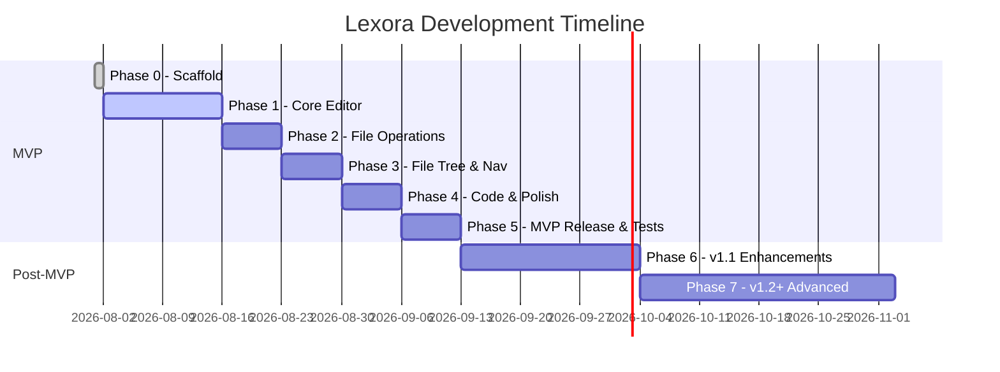

# Lexora Project Roadmap

This document outlines the phased development roadmap and milestone deliverables for Lexora, from the initial scaffold through the production MVP and post-MVP releases.

---

## 1. Phased Development Plan

---

### Phase 0 — Project Scaffold (~1 day) :white_check_mark: Completed
- [x] Initialize Tauri 2 + SolidJS + Vite 6 project base.
- [x] Configure TypeScript strict mode and Tailwind CSS 4.
- [x] Establish Rust backend architecture (`commands`, `models`, `services`, `state`).
- [x] Implement initial IPC hello world ping-pong command.
- [x] Configure repository documentation, formatting, and linting standards.

---

### Phase 1 — Core Reader MVP (~1–2 weeks) :white_check_mark: Completed
- [x] Resizable three-part layout (TOC sidebar on left, main markdown render view in center, status bar footer).
- [x] Local `.md`, `.markdown`, `.mdx`, `.txt` file open dialog via native dialog plugin.
- [x] High-performance GFM Markdown parsing and TOC extraction in Rust via `pulldown-cmark`.
- [x] Background file watcher service (`notify`) with live external modification alert banner.
- [x] Dark / Light / System theme toggle using CSS variables with OS preference auto-detection.
- [x] Status bar showing filename, word count, theme toggle, and external modification badge.
- [x] Standalone executable and Windows installers (NSIS 3.38 MB, WiX MSI 4.92 MB).

---

### Phase 2 — In-Place WYSIWYG & Display Modes (~1–2 weeks) :white_check_mark: Completed
- [x] **Three Tri-State Display Modes** (switchable via bottom status bar & shortcuts):
  1. **Reading Mode** (📖): Read-only view rendering clean GFM Markdown text.
  2. **Writing Mode** (✍️): Typora-style in-place WYSIWYG editing (reveal syntax on cursor focus, render on blur).
  3. **Code Mode** (💻): Raw plain-text Markdown source view with monospace font and line numbers.
- [x] Milkdown v7 editor integration inside SolidJS lifecycle.
- [x] Full keyboard shortcut support (<kbd>Ctrl+B</kbd>, <kbd>Ctrl+I</kbd>, <kbd>Ctrl+K</kbd>, <kbd>Ctrl+1..6</kbd>).
- [x] Robust Undo / Redo history stack via ProseMirror state (<kbd>Ctrl+Z</kbd> / <kbd>Ctrl+Y</kbd>).
- [x] Native atomic file saving (<kbd>Ctrl+S</kbd>) with temporary file rename pattern.
- [x] Dirty document state tracking and unsaved changes confirmation prompt on close/exit.

---

### Phase 3 — File Tree & Navigation (~1 week) :white_check_mark: Completed
- [x] Open Workspace Folder capability via native dialog.
- [x] Recursive directory scanner and structured file tree model in Rust (`list_directory_tree`).
- [x] SolidJS nested File Tree sidebar component with expandable folders and file creation, rename, and delete actions.
- [x] Multi-document tab bar (`TabBar`) with tab switching, dirty indicators, and close actions.
- [x] Quick file switcher command palette (<kbd>Ctrl+P</kbd>).
- [x] Collapsible sidebar toggle (<kbd>Ctrl+B</kbd>).

---

### Phase 4 — Code Highlighting & Polish (~1 week) :white_check_mark: Completed
- [x] Rust-side `syntect` integration for server-rendered syntax highlighting with rich themes.
- [x] Client-side code block syntax highlighting for standard languages (Rust, JS, TS, Python, Go, JSON, YAML, etc.).
- [x] Code block language badge and instant copy-to-clipboard action button.
- [x] Comprehensive Status Bar displaying word count, character count, encoding (UTF-8), line endings (LF/CRLF), theme toggle, and display mode switcher.

---

### Phase 5 — MVP Release & Testing (~1 week) :white_check_mark: Completed
- [x] Comprehensive Vitest unit tests for SolidJS components and stores (`editor.test.ts`, `files.test.ts`, `settings.test.ts`).
- [x] Full Rust unit test coverage for atomic writer, directory scanner, syntect highlighter, and parser.
- [x] Tauri v2 capability lockdown (minimal required filesystem and dialog scopes).
- [x] Cross-platform release builds & GitHub Actions packaging workflows configured.
- [x] **Lexora v1.0.0 Public MVP Release Ready**.

---

### Phase 6 — Post-MVP v1.1 (~2–3 weeks) :construction: In Progress
- [ ] In-document Find & Replace with regex support.
- [ ] PDF & standalone HTML export via `pulldown-cmark` and headless print engine.
- [ ] Interactive WYSIWYG Table editor with row/column insertion and alignment controls.
- [ ] Drag-and-drop & clipboard image paste handling (auto-saving images to local workspace asset directory).
- [ ] Dynamic Table of Contents (TOC) outline sidebar.
- [ ] Configurable background auto-save.

---

### Phase 7 — Advanced v1.2+ (Ongoing)
- [ ] Mathematical formula rendering via KaTeX (`$...$` and `$$...$$`).
- [ ] Live diagram rendering via Mermaid.js (`mermaid` code blocks).
- [ ] Typewriter / Zen Mode (scrolling keeping active line vertically centered).
- [ ] Focus Mode (dims all paragraphs except the current active block).
- [ ] Custom CSS themes and user stylesheet overrides.
- [ ] Global workspace full-text search indexing.

---

## 2. Feature Priority Matrix (MoSCoW)

| Category | Features | Target Phase |
| :--- | :--- | :--- |
| **Must Have** *(Critical for MVP)* | - Typora-style WYSIWYG editor via Milkdown - Atomic file open / save operations - Tabbed interface & dirty state tracking - Workspace folder navigation & file tree - Dark / Light mode switching - Status bar (word count, line/column) - Strict security capabilities & local-only storage | Phase 0–5 |
| **Should Have** *(Important for v1.1)* | - Find and Replace toolbar - HTML & PDF export - Interactive table editor - Clipboard image paste / local asset management - Document outline / TOC sidebar - Auto-save timer | Phase 6 |
| **Could Have** *(Desirable for v1.2+)* | - KaTeX math rendering - Mermaid diagram rendering - Typewriter mode & Zen mode - Custom user themes & CSS overrides - Global workspace full-text search - Vim keybinding mode | Phase 7 |
| **Won't Have** *(Out of Scope)* | - Cloud sync backend / proprietary account login (Lexora remains 100% local-first) - Multi-user real-time collaborative editing (CRDTs) - Heavy IDE extensions / LSP debugging | Out of Scope |
